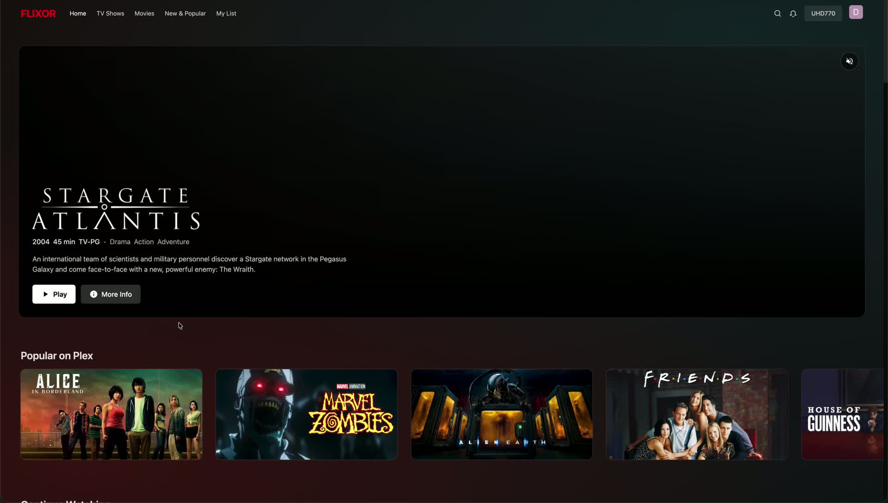
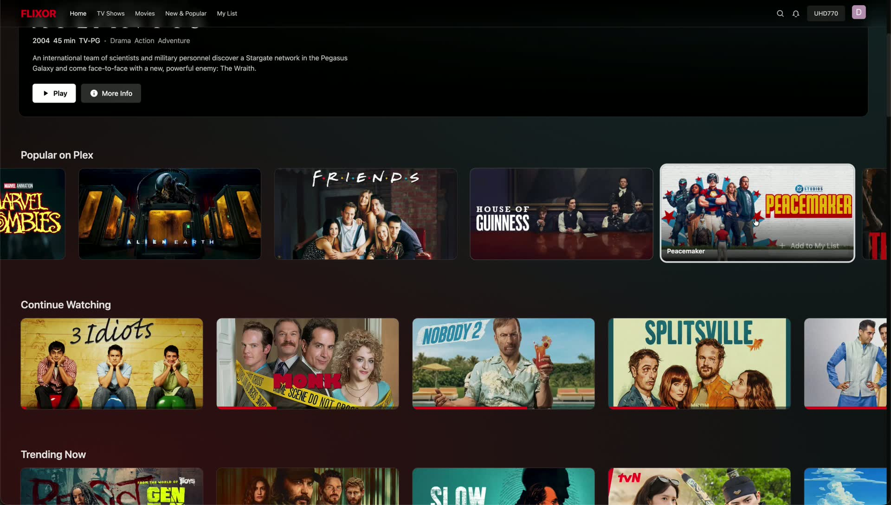
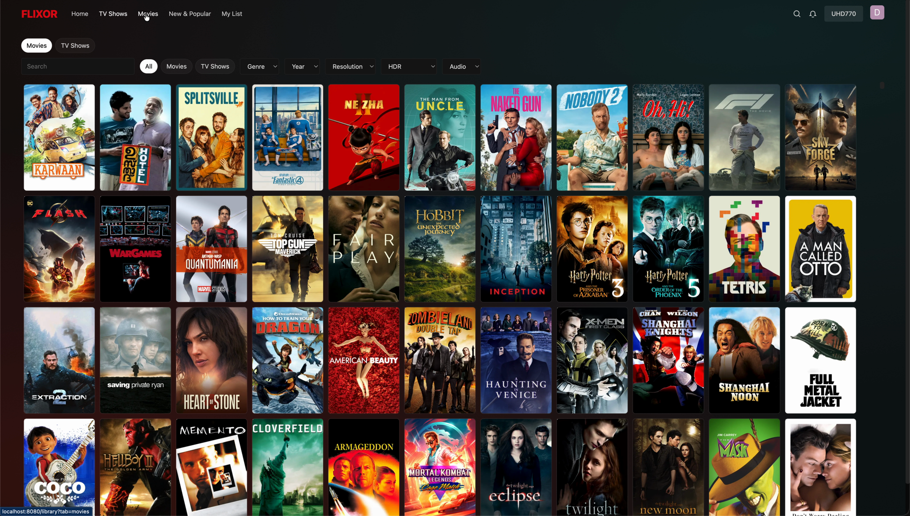
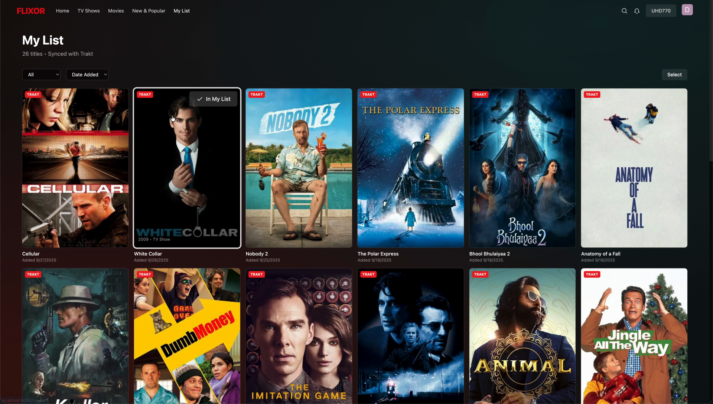
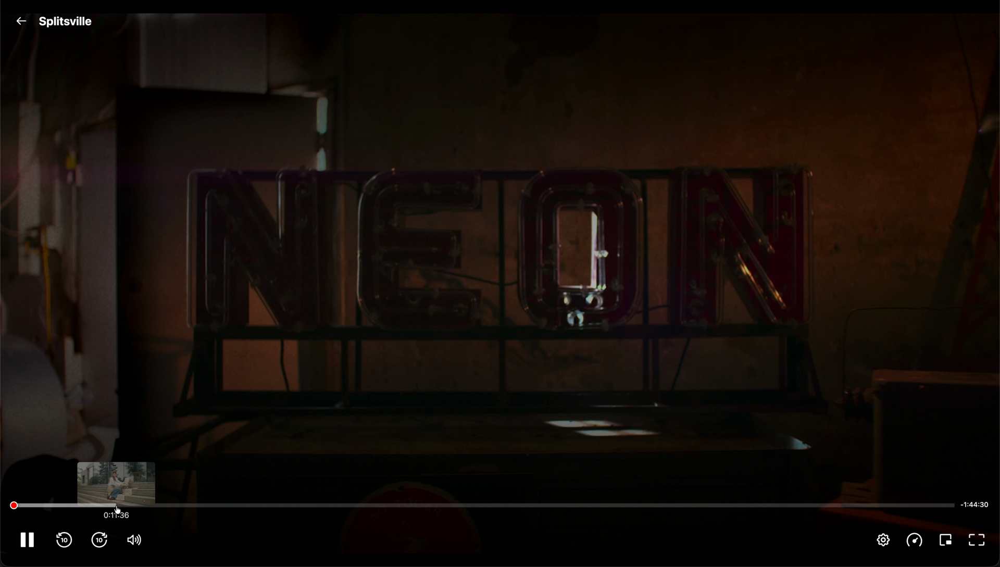
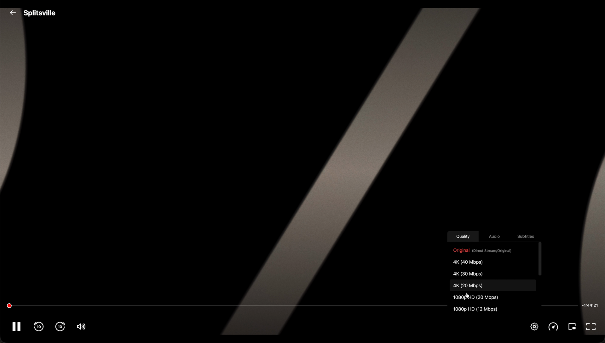
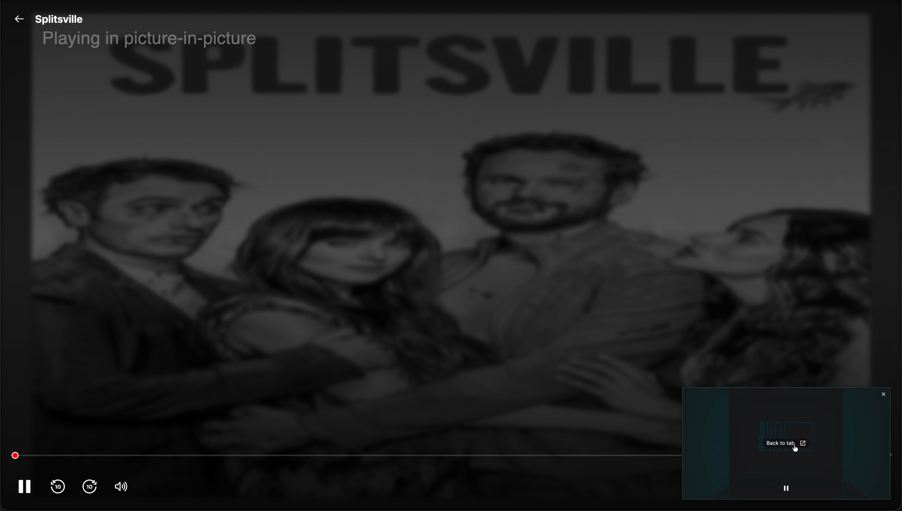
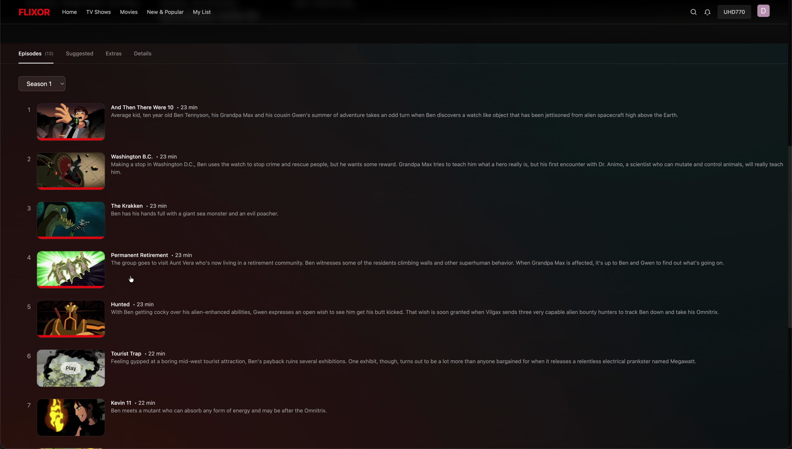
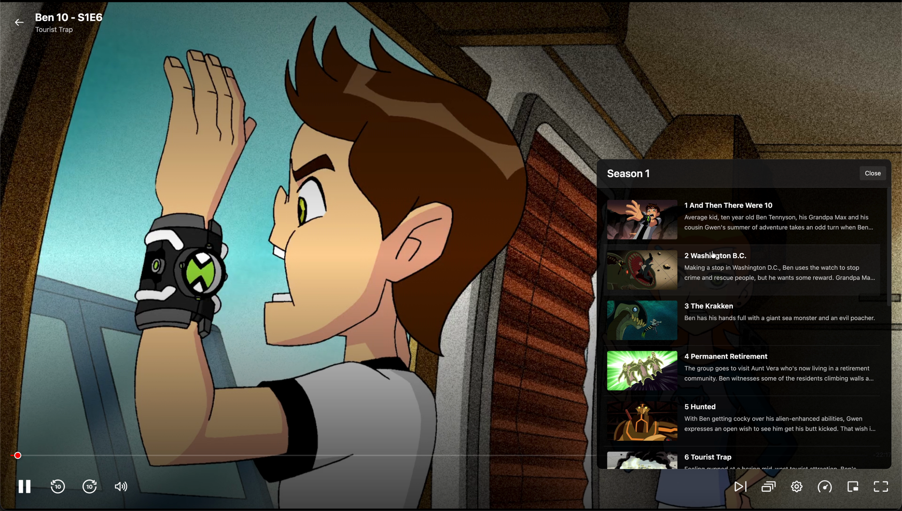

# Plex Media Manager (Web)

## Description
A fast, Netflix‑style web app for your Plex library. Browse beautiful rows, see rich details (IMDb/Rotten Tomatoes), and play instantly in your browser with built‑in DASH/HLS playback. Works on any modern desktop or mobile browser.

## Features
- Netflix‑style home: Continue Watching, Trending, Collections, and more
- Built‑in player: DASH/HLS, fullscreen, Picture‑in‑Picture, subtitles
- Rich details: trailers/extras, cast, badges (4K/HDR/Atmos), IMDb/RT ratings
- Smart search and filters; ultra‑fast grids optimized for large libraries
- Recommendations from TMDB/Trakt plus Plex On Deck
- Smooth, responsive UI with image optimization and caching

## Installation
- Quick start (Docker, recommended)
  1) Ensure Docker Desktop is installed
  2) In this folder, run: `docker compose up -d`
  3) Open `http://localhost:8080` and sign in with Plex

- Local (advanced)
  1) Install Node.js 18+ and npm
  2) Run: `npm install` then `npm run dev:all`
  3) Open `http://localhost:8080` and sign in with Plex

That’s it—no extra setup needed. The app uses the bundled backend by default; the database is created and migrations run automatically on first start.

## Screenshots

